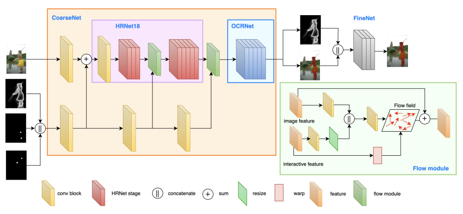

### Interactive Image_VideoSegmentation
|No.   |Figure   |Method   |Title  |Pub.  |Git. |Year |Framework |Type |Dataset |PreTrainedModel |TrainingPipeline |TestPipeline |License
|-----|:--------------------:|:-----:|:-----:|:-----:|:---:|:---:|:-----:|:-----:|:-----:|:-----:|:-----:|:-----:|:-----:|
|01||__SimpleClick__|__SimpleClick: Interactive Image Segmentation with Simple Vision Transformers__|[`paper`](https://arxiv.org/pdf/2210.11006v2.pdf)|[`GIT`](https://github.com/uncbiag/SimpleClick)|__2022__|Pytorch|Click(one or more)|GrabCut,Berkeley,DAVIS,PascalVOC,SBD|Yes|Yes|Yes|MIT|
|02||__EISeg__|__EISeg: An Efficient Interactive Segmentation Tool based on PaddlePaddle__|[`paper`](https://arxiv.org/pdf/2210.08788v2.pdf)|[`GIT`](https://github.com/PaddlePaddle/PaddleSeg)|__2022__|Pytorch|Click(one or more)|GrabCut,Berkeley,DAVIS,PascalVOC|Yes|Yes|Yes|Apache-2.0 |
