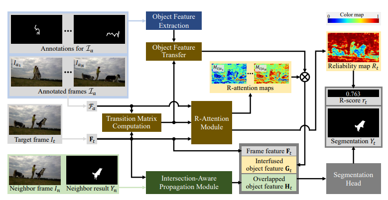

### Interactive Image_VideoSegmentation
|No.   |ArchitectureBlockDiagram      |Method   |Title  |Pub.  |Git. |Year |Framework |Type |Dataset |PreTrainedModel |TrainingPipeline |TestPipeline |License
|-----|:-----:|:-----:|:-----:|:-----:|:---:|:---:|:-----:|:-----:|:-----:|:-----:|:-----:|:-----:|:-----:|
|01  |  |__SimpleClick__|__SimpleClick: Interactive Image Segmentation with Simple Vision Transformers__|[`paper`](https://arxiv.org/pdf/2210.11006v2.pdf)|[`GIT`](https://github.com/uncbiag/SimpleClick)|__2022__|Pytorch|Click(one or more)|GrabCut,Berkeley,DAVIS,PascalVOC,SBD|Yes|Yes|Yes|MIT|
|02  |           |__EISeg__|__EISeg: An Efficient Interactive Segmentation Tool based on PaddlePaddle__|[`paper`](https://arxiv.org/pdf/2210.08788v2.pdf)|[`GIT`](https://github.com/PaddlePaddle/PaddleSeg)|__2022__|Pytorch|Click(one or more)|GrabCut,Berkeley,DAVIS,PascalVOC|Yes|Yes|Yes|Apache-2.0 |
|03  |           |__FocalClick__|__FocalClick: Towards Practical Interactive Image Segmentation__|[`paper`](https://arxiv.org/pdf/2204.02574v2.pdf)|[`GIT`](https://github.com/XavierCHEN34/ClickSEG)|__2022__|Pytorch|Click|SBD,COCOHAVOC,GrabCut,Berkeley,DAVIS,PascalVOC|Yes|Yes|Yes|Apache-2.0|
|04  |           |__FocusCut__|__FocusCut: Diving into a Focus View in Interactive Segmentation__|[`paper`](https://openaccess.thecvf.com/content/CVPR2022/papers/Lin_FocusCut_Diving_Into_a_Focus_View_in_Interactive_Segmentation_CVPR_2022_paper.pdf)|[`GIT`](https://github.com/frazerlin/focuscut)|__2022__|Pytorch|Cut|SBD|Yes|Yes|Yes|Attribution-NonCommercial 4.0 Internationa |
|05 |           |__GIS-RAmap__|__Guided Interactive Video Object Segmentation Using Reliability-Based Attention Maps__|[`paper`](https://arxiv.org/pdf/2104.10386v1.pdf)|[`GIT`](https://github.com/yuk6heo/GIS-RAmap)|__2021__|Pytorch|Curve|DAVIS|Yes|Yes|Yes|MIT |