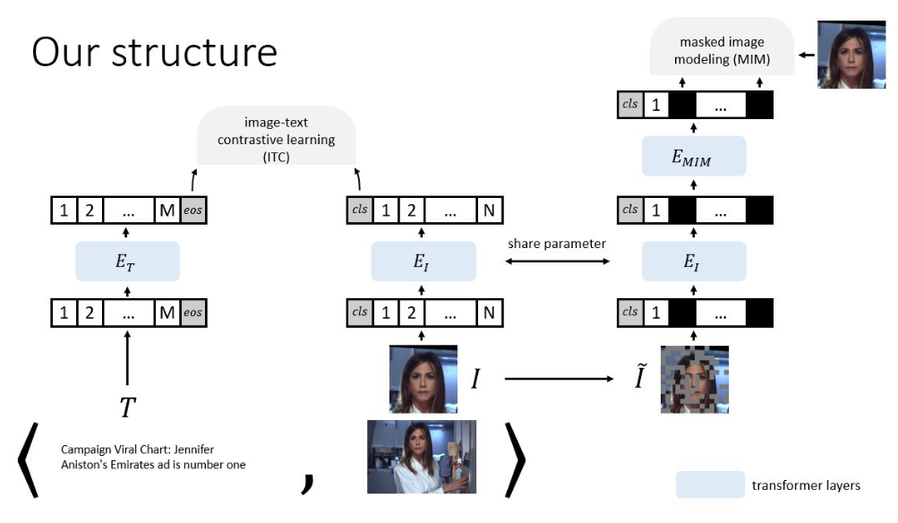
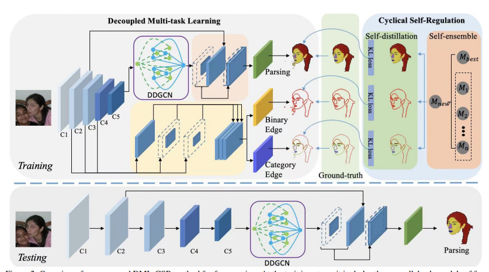
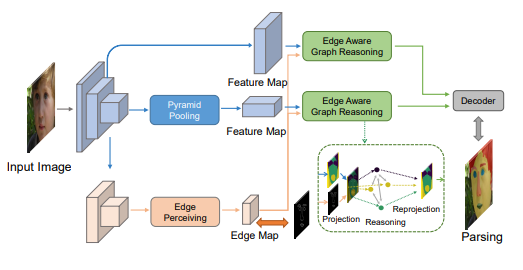
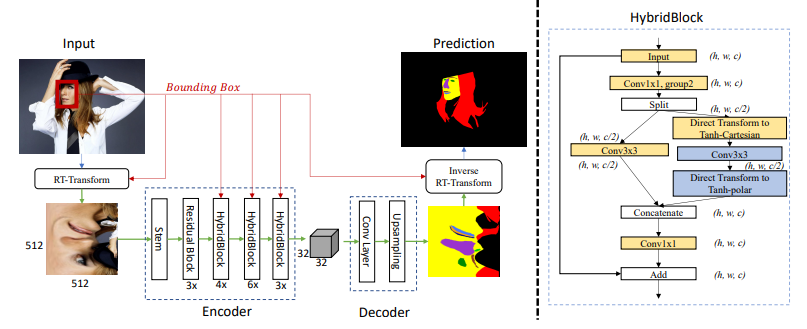
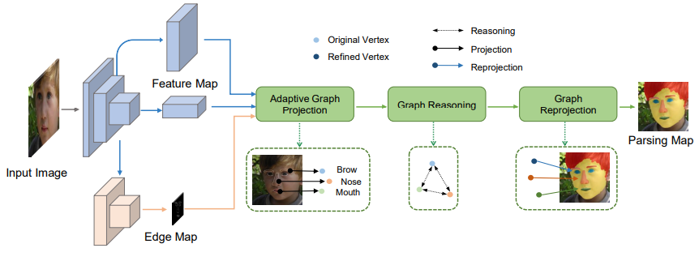
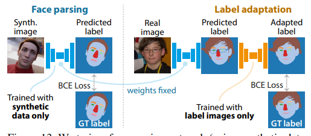
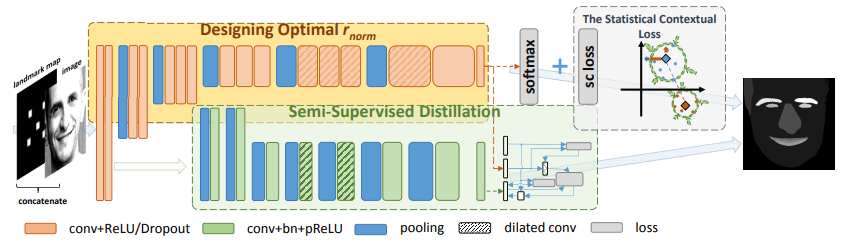
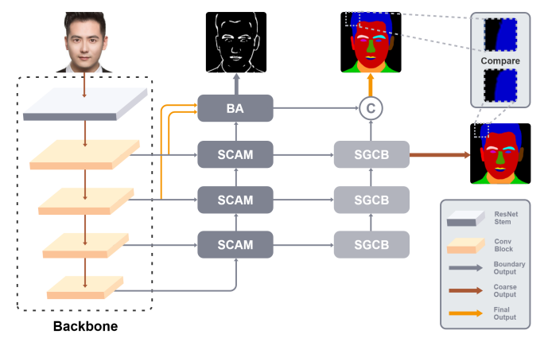

### Face Parsing
| | | | | | | | | | | | | | | |
|-|-|-|-|-|-|-|-|-|-|-|-|-|-|-|
| |**SLNo**|**Architecture_Block_Diagram**|**Model**|**PaperLink**|**GitHub**|**Dataset**|**Framework**|**Year**|**Training Pipeline**|**Testing Pipeline**|**Loss**|**License**|**Keywords**|
| |1| |FaRL-B|[`General Facial Representation Learning in a Visual-Linguistic Manner`](https://arxiv.org/abs/2112.03109) |https://github.com/FacePerceiver/FaRL|LaPa CelebAMask-HQ|Pytorch|2021|Yes|NA|Contrastive, Binary cross entropy|MIT| |
| | | | | | | | | | | | | | | |
| |2| |DML-CSR| [`Decoupled Multi-task Learning with Cyclical Self-Regulation for Face Parsing`](https://arxiv.org/pdf/2203.14448.pdf) |https://github.com/deepinsight/insightface|Helen LaPa CelebAMask-HQ|Pytorch|2022|Yes|Yes|Consistency, Lovasz Softmax, KL Divergence|MIT| |
| | | | | | | | | | | | | | | |
| |3| |EAGRNet|[`Edge-aware Graph Representation Learning and Reasoning for Face Parsing`](https://www.ecva.net/papers/eccv_2020/papers_ECCV/papers/123570256.pdf)|https://github.com/tegusi/EAGRNet|Helen LaPa CelebAMask-HQ|Pytorch|2021|Yes|Yes(eval)|BA(boundary attention) loss, Cross entropy loss|NA| |
| | | | | | | | | | | | | | | |
| |4| |RT-Net|[`RoI Tanh-polar Transformer Network for Face Parsing in the Wild`](https://arxiv.org/pdf/2102.02717.pdf)|https://github.com/hhj1897/face_parsing|LaPa iBugMask|Pytorch|2021|NA|Yes|Cross entropy loss, Dice loss|MIT| |
| | | | | | | | | | | | | | | |
| |5| |AGRNet| [`AGRNet: Adaptive Graph Representation Learning and Reasoning for Face Parsing`](https://arxiv.org/pdf/2101.07034v3.pdf) |NA|LaPa Helen(merged cls) CelebAMask-HQ|NA|2021|NA|NA|Cross Entropy loss, BA Loss, Discriminative loss|NA| |
| | | | | | | | | | | | | | | |
| |6| |UNet(real)| [`Fake It Till You Make It: Face analysis in the wild using synthetic data alone`](https://arxiv.org/pdf/2109.15102v2.pdf) |NA|Helen LaPa|NA|2021|NA|NA|BCE Loss|Custom| |
| | | | | | | | | | | | | | | |
| |7| |UNet(synthetic)| [`Fake It Till You Make It: Face analysis in the wild using synthetic data alone`](https://arxiv.org/pdf/2109.15102v2.pdf) |NA|LaPa Helen|NA|2021|NA|NA|BCE Loss|Custom| |
| | | | | | | | | | | | | | | |
| |8| |AFIP| [`Accurate facial image parsing at real-time speed`](http://www.colalab.org/media/paper/bare_jrnl_EjnyBQb.pdf) |NA|LaPa CelebAMask-HQ|NA|2019|NA|NA|SC Loss(Statistical Contextual loss)|NA| |
| | | | | | | | | | | | | | | |
| |9| |EHANet| [`EHANet: An Effective Hierarchical Aggregation Network for Face Parsing`](https://www.researchgate.net/publication/341129398_EHANet_An_Effective_Hierarchical_Aggregation_Network_for_Face_Parsing) |https://github.com/JACKYLUO1991/FaceParsing|CelebAMask-HQ LaPa Helen|Pytorch|2020|Yes|Yes|Boundary Aware loss|MIT| |
