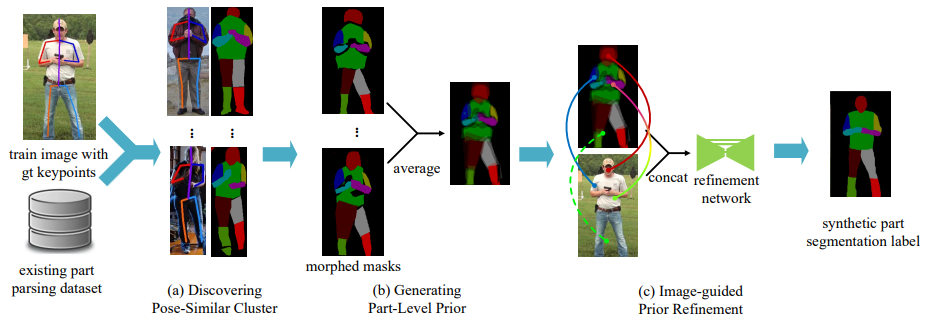

### Human  Parsing
| | | | | | | | | | | | | | | |
|-|-|-|-|-|-|-|-|-|-|-|-|-|-|-|
|**SLNo**|**Architecture_Block_Diagram**|**Method**|**Paper_Link** |**Github_Link** |**Year**|**Framework**|**Dataset**|**Loss Functions**|**PreTrained Weight**|**Training Pipeline**|**Testing Pipeline**|**License**|**Keywords**|
| | | | | | | | | | | | | | | |
|1| |WSHP|[`Weakly and Semi Supervised Human Body Part Parsing via Pose-Guided Knowledge Transfer`](https://arxiv.org/pdf/1805.04310v1.pdf)|https://github.com/MVIG-SJTU/WSHP/tree/master/parsing_network|2018|Tensorflow|Pascal-Person-Part Dataset MPII Horse-Cow |Sparse-Softmax-Cross-Entropy, L2 Loss|Yes|Yes|Yes|Custom| |
| | | | | | | | | | | | | | | |
|2| |MMAN|[`Macro-Micro Adversarial Network for Human Parsing`](https://arxiv.org/pdf/1807.08260v2.pdf)|https://github.com/RoyalVane/MMAN|2018|Pytorch|LIP Pascal-Person-Part Dataset|MSE, BCE, L1 Loss, NLLLoss2d|Yes|Yes|Yes|Custom| |
| | | | | | | | | | | | | | | |
|3| |CorrPM|[`Correlating Edge, Pose with Parsing`](https://openaccess.thecvf.com/content_CVPR_2020/papers/Zhang_Correlating_Edge_Pose_With_Parsing_CVPR_2020_paper.pdf)|https://github.com/ziwei-zh/CorrPM|2020|Pytorch|LIP|CrossEntropy, MSE|Yes|Yes|Yes|MIT| |
| | | | | | | | | | | | | | | |
|4| |ISP-ReiD|[`Identity-Guided Human Semantic Parsing for Person Re-Identification`](https://arxiv.org/pdf/2007.13467.pdf)|https://github.com/CASIA-IVA-Lab/ISP-reID|2020|Pytorch|DukeMTMC|CrossEntropy, MarginRanking, SoftMargin|NA|Yes|Yes| Apache-2.0| |
| | | | | | | | | | | | | | | |
|5| |SCHP|[`Self-Correction Human Parsing`](https://arxiv.org/pdf/1910.09777v1.pdf)|https://github.com/PeikeLi/Self-Correction-Human-Parsing|2021|PyTorch|LIP ATR Pascal-Person-Part|CrossEntropy, LovaszSoftmax, KLDivergence, Consistensy|Yes|Yes|Yes(eval)|MIT| |
| | | | | | | | | | | | | | | |
|6| |CE2P|[`Devil in the Details: Towards Accurate Single and Multiple Human Parsing`](https://arxiv.org/pdf/1809.05996.pdf)|https://github.com/liutinglt/CE2P|2020|PyTorch|LIp|CrossEntropy|Yes|Yes|Yes|NA| |
| | | | | | | | | | | | | | | |
|7| |MG-HumanParsing|[`Differentiable Multi-Granularity Human Representation Learning for Instance-Aware Human Semantic Parsing`](https://arxiv.org/pdf/2103.04570.pdf)|https://github.com/tfzhou/MG-HumanParsing|2021|PyTorch|Pascal MHP-v2 DensePoseData|L!-Loss, Laplace|No|Yes|Yes|NA| |
| | | | | | | | | | | | | | | |
|8| |NASJHPE|[`Neural Architecture Search for Joint Human Parsing and Pose Estimation`](https://openaccess.thecvf.com/content/ICCV2021/papers/Zeng_Neural_Architecture_Search_for_Joint_Human_Parsing_and_Pose_Estimation_ICCV_2021_paper.pdf)|https://github.com/GuHuangAI/NP|2021|PyTorch|LIP Pascal-Person-Part|CrossEntropy, MSELoss|No|Yes|Yes|NA| |
| | | | | | | | | | | | | | | |
|9| |Hierarchical-HP|[`Hierarchical Human Parsing with Typed Part-Relation Reasoning`](https://openaccess.thecvf.com/content_CVPR_2020/papers/Wang_Hierarchical_Human_Parsing_With_Typed_Part-Relation_Reasoning_CVPR_2020_paper.pdf)|https://github.com/hlzhu09/Hierarchical-Human-Parsing|2020|PyTorch|LIP Pascal-Person-Part ATR |CrossEntropy|No|Yes|Yes|NA| |
| | | | | | | | | | | | | | | |
|10| |Compositional-HP|[`Learning Compositional Neural Information Fusion for Human Parsing`](https://openaccess.thecvf.com/content_ICCV_2019/papers/Wang_Learning_Compositional_Neural_Information_Fusion_for_Human_Parsing_ICCV_2019_paper.pdf)|https://github.com/ZzzjzzZ/CompositionalHumanParsing|2019|PyTorch|LIP Pascal-Person-Part ATR |Cross Entropy|Yes|No|Yes|NA| |
| | | | | | | | | | | | | | | |
|11| |Grapy-ML|[`Grapy-ML: Graph Pyramid Mutual Learning for Cross-dataset Human Parsing`](https://arxiv.org/pdf/1911.12053.pdf)|https://github.com/Charleshhy/Grapy-ML|2020|PyTorch|CHIP|CrossEntropy|Yes|Yes|Yes|MIT| |
| | | | | | | | | | | | | | | |
|12| |M2FP|[`M2FP: Mask2Former for Parsing`](https://arxiv.org/pdf/2301.00394.pdf)|https://github.com/soeaver/m2fp|2023|PyTorch|LIP Pascal-Person_Part CIHP MHP-v2|NA|Yes|Yes|Yes|CCA 4.0| |
| | | | | | | | | | | | | | | |
|13| |CDGNet|[`CDGNet: Class Distribution Guided Network for Human Parsing`](https://arxiv.org/pdf/2111.14173.pdf)|https://github.com/tjpulkl/CDGNet|2022|PyTorch|LIP CIHP|CDG Loss, Cross Entropy|Yes|Yes|Yes|NA| |
| | | | | | | | | | | | | | | |
|14| |HSSN|[`Deep hierarchical semantic segmentation`](https://arxiv.org/pdf/2203.14335.pdf)|https://github.com/qhanghu/HSSN_pytorch|2022|PyTorch|LIP Pascal-Person-Part|Focal tree-min loss, tree triplet loss|Yes|Yes |Yes|NA| |
| | | | | | | | | | | | | | | |
|15| |QANet|  [`Quality-Aware Network for Human Parsing`](https://arxiv.org/pdf/2103.05997v1.pdf)|https://github.com/soeaver/QANet|2021|PyTorch|LIP CIHP|Cross Entropy Loss, Lovasz Loss|Yes|Yes |Yes|MIT| |
