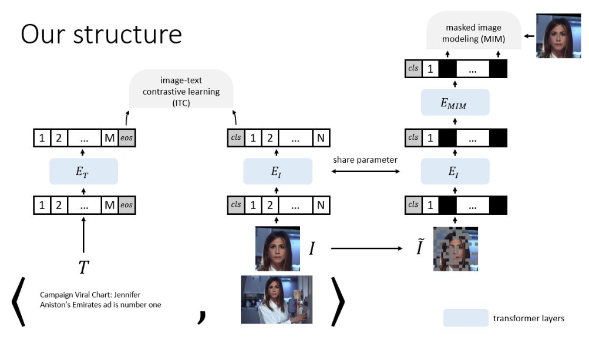
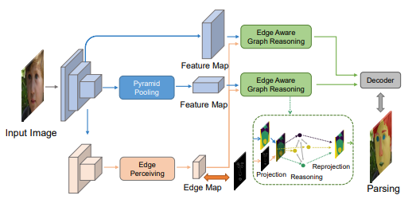
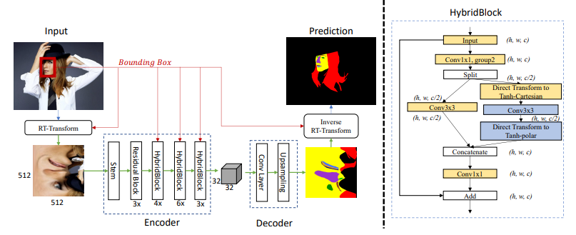
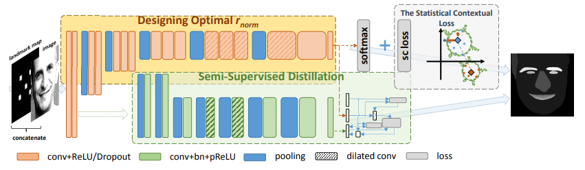
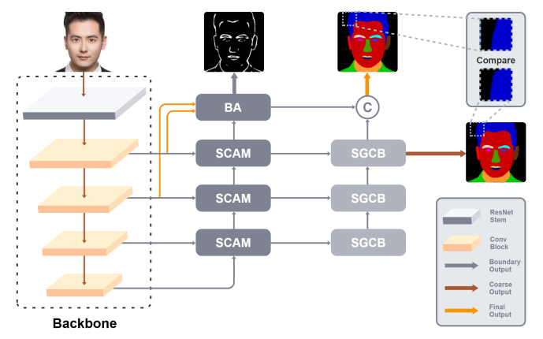

### Human Face Parsing
| | | | | | | | | | | | | | |
|-|-|-|-|-|-|-|-|-|-|-|-|-|-|
| |**SLNo**|**Architecture_Block_Diagram**|**Model**|**Title**|**GitHub**|**Paper**|**Dataset**|**Framework**|**Year**|**Training Pipeline**|**Testing Pipeline**|**License**|**Keywords**|
| | | | | | | | | | | | | | |
| |1| |FaRL-B| General Facial Representation Learning in a Visual-Linguistic Manner |https://github.com/FacePerceiver/FaRL|https://arxiv.org/abs/2112.03109|LaPa CelebAMaskHQ|Pytorch|2021|Yes|NA|MIT| |
| | | | | | | | | | | | | | |
| |2| |DML-CSR| Decoupled Multi-task Learning with Cyclical Self-Regulation for Face Parsing |https://github.com/deepinsight/insightface|https://arxiv.org/pdf/2203.14448.pdf|Helen LaPa CelebAMaskHQ|Pytorch|2022|Yes|Yes|MIT| |
| | | | | | | | | | | | | | |
| |3||EAGRNet|Edge-aware Graph Representation Learning and Reasoning for Face Parsing|https://github.com/tegusi/EAGRNet|https://arxiv.org/abs/2007.11240|Helen LaPa CelebAMaskHQ|Pytorch|2021|Yes|Yes(eval)|NA| |
| | | | | | | | | | | | | | |
| |4| |RT-Net|RoI Tanh-polar Transformer Network for Face Parsing in the Wild|https://github.com/hhj1897/face_parsing|https://arxiv.org/pdf/2102.02717.pdf|LaPa iBugMask|Pytorch|2021|NA|Yes|MIT| |
| | | | | | | | | | | | | | |
| |5| |AGRNet| AGRNet: Adaptive Graph Representation Learning and Reasoning for Face Parsing |NA|https://arxiv.org/pdf/2101.07034v3.pdf|LaPa Helen(merged cls) CelebAMaskHQ|NA|2021|NA|NA|NA| |
| | | | | | | | | | | | | | |
| |6| |UNet(real)| Fake It Till You Make It: Face analysis in the wild using synthetic data alone |NA|https://arxiv.org/pdf/2109.15102v2.pdf|Helen LaPa|NA|2021|NA|NA|Custom| |
| | | | | | | | | | | | | | |
| |7| |UNet(synthetic)| Fake It Till You Make It: Face analysis in the wild using synthetic data alone |NA|https://arxiv.org/pdf/2109.15102v2.pdf|LaPa Helen|NA|2021|NA|NA|Custom| |
| | | | | | | | | | | | | | |
| |8| |BASS| A New Dataset and Boundary-Attention Semantic Segmentation for Face Parsing |https://github.com/JDAI-CV/lapa-dataset|https://arxiv.org/abs/2007.11240|LaPa|NA|2020|NA|NA|Custom| |
| | | | | | | | | | | | | | |
| |9| |AFIP| Accurate facial image parsing at real-time speed |NA|https://ieeexplore.ieee.org/document/8682072|LaPa CelebAMaskHQ|NA|2019|NA|NA|NA| |
| | | | | | | | | | | | | | |
| |10||EHANet| EHANet: An Effective Hierarchical Aggregation Network for Face Parsing |https://github.com/JACKYLUO1991/FaceParsing|https://www.mdpi.com/704822|CelebAMaskHQ LaPa Helen|Pytorch|2020|Yes|Yes|MIT| |
